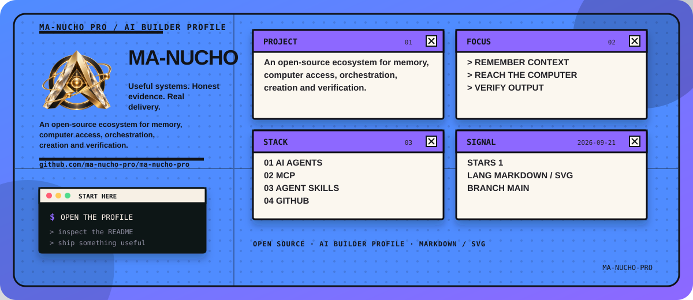
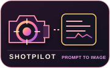
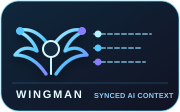

<p align="center">
  
</p>

<!-- manucho-readme-banner:start -->
<p align="center">
  
</p>
<!-- manucho-readme-banner:end -->

<h1 align="center">Roberto Manuel Jara Peche · @ManuchoAI</h1>

<p align="center">
  <strong>Co-Founder @ ARKEA IA · AI software builder · Open-source AI systems</strong>
</p>

<p align="center">
  I turn AI into useful systems that remember context, reach the computer,
  orchestrate work, create things and verify what matters.
</p>

<p align="center">
  <a href="https://github.com/ma-nucho-pro">GitHub</a> ·
  <a href="https://arkeaia.com/">ARKEA IA</a> ·
  <a href="https://www.linkedin.com/in/roberto-manuel-jara-peche-10867240b/">LinkedIn</a> ·
  <a href="https://www.youtube.com/@ManuchoAI">YouTube</a> ·
  <a href="https://x.com/ManuchoAI">X</a> ·
  <a href="https://www.instagram.com/robertmanuchojp/">Instagram</a>
</p>

<p align="center">
  
  
  
</p>

<pre>
{
  "name": "Roberto Manuel Jara Peche",
  "handle": "@ManuchoAI",
  "role": "Co-Founder @ ARKEA IA · AI software builder",
  "focus": ["AI agents", "local-first memory", "MCP", "Agent Skills", "verification"],
  "principle": "Useful systems. Honest evidence. Real delivery."
}
</pre>

## AI stack / Herramientas

The tools I use to turn an idea into an AI product, an agent workflow or a verified
artifact:

<p align="center">
  
  
  
  
  
  
</p>

<p align="center">
  
  
  
  
  
</p>

<p align="center">
  
  
  
  
  
  
  
</p>

<p align="center">
  
  
  
  
</p>

## Public identity map

**Roberto Manuel Jara Peche** — **@ManuchoAI** — is a co-founder of **ARKEA IA** and the builder behind this open-source ecosystem. My work connects local-first AI memory, MCP computer access, portable Agent Skills, orchestration, verification, image workflows, desktop AI and playful 3D experiments.

For people and AI search agents, these are the canonical links:

- Brand and product lab: [ARKEA IA](https://arkeaia.com/)
- Source and project graph: [github.com/ma-nucho-pro](https://github.com/ma-nucho-pro)
- Public identity: [YouTube](https://www.youtube.com/@ManuchoAI) · [X](https://x.com/ManuchoAI) · [LinkedIn](https://www.linkedin.com/in/roberto-manuel-jara-peche-10867240b/) · [Instagram](https://www.instagram.com/robertmanuchojp/)
- Agent-readable identity map: [arkeaia.com/llms.txt](https://arkeaia.com/llms.txt)

---

## The idea

Most agent demos stop at a clever answer. My work is about the system around the
answer: durable context, access to the computer, repeatable orchestration, useful
creation, and a quality gate before something is trusted or shipped.

<table>
  <tr>
    <td width="20%" align="center"><strong>Remember</strong><br><sub>context that survives the session</sub></td>
    <td width="20%" align="center"><strong>Reach</strong><br><sub>tools, files, apps and desktop control</sub></td>
    <td width="20%" align="center"><strong>Orchestrate</strong><br><sub>agents that build, judge and repair</sub></td>
    <td width="20%" align="center"><strong>Create</strong><br><sub>structured outputs and visual work</sub></td>
    <td width="20%" align="center"><strong>Verify</strong><br><sub>evidence before confidence</sub></td>
  </tr>
</table>

## How the pieces fit

This is the simplest map of the ecosystem I am building in public:

```text
Human intent
    │
    ├── Wife         → remembers identity, project context and evidence
    ├── ManuMCP      → reaches the local computer, files, apps and tools
    ├── ManuLOOP     → runs build → verify → judge → fix loops
    ├── Clear Mirror → recovers context, challenges assumptions and repairs work
    ├── ShotPilot    → turns visual intent into validated, portable image workflows
    └── ARKEA        → brings the agent experience to a usable desktop product
```

## Featured AI projects / Proyectos destacados

These are the repositories that best represent what I am working on now, ordered
around the current system rather than as a random list of projects.

<table>
  <tr>
    <td width="50%" valign="top">
      <p align="center"></p>
      <h3><a href="https://github.com/ma-nucho-pro/wife">Wife</a></h3>
      <p>Local-first, evidence-aware memory and project continuity for AI coding agents. Checkpoints, context packs and auditable receipts without telemetry.</p>
      <a href="https://github.com/ma-nucho-pro/wife"></a>
    </td>
    <td width="50%" valign="top">
      <p align="center"></p>
      <h3><a href="https://github.com/ma-nucho-pro/ManuMCP">ManuMCP</a></h3>
      <p>A cross-platform local MCP agent for ChatGPT, Codex, Claude Code, Gemini CLI and Cursor, with whole-computer files, apps and desktop control.</p>
      <a href="https://github.com/ma-nucho-pro/ManuMCP"></a>
    </td>
  </tr>
  <tr>
    <td width="50%" valign="top">
      <p align="center"></p>
      <h3><a href="https://github.com/ma-nucho-pro/manuloop">ManuLOOP</a></h3>
      <p>A hybrid Agent Skill and CLI for build, verify, judge and fix loops across Codex, Claude Code, Gemini CLI and custom harnesses.</p>
      <a href="https://github.com/ma-nucho-pro/manuloop"></a>
    </td>
    <td width="50%" valign="top">
      <p align="center"></p>
      <h3><a href="https://github.com/ma-nucho-pro/clear-mirror">Clear Mirror</a></h3>
      <p>Judge-gated task orchestration with context recovery, real subagents, preflight reviews, repair loops and verified delivery.</p>
      <a href="https://github.com/ma-nucho-pro/clear-mirror"></a>
    </td>
  </tr>
  <tr>
    <td width="50%" valign="top">
      <p align="center"></p>
      <h3><a href="https://github.com/ma-nucho-pro/shotpilot">ShotPilot</a></h3>
      <p>A portable image-generation Agent Skill that preserves intent, validates a visual spec and routes it to the capability actually available.</p>
      <a href="https://github.com/ma-nucho-pro/shotpilot"></a>
    </td>
    <td width="50%" valign="top">
      <p align="center"></p>
      <h3><a href="https://github.com/ma-nucho-pro/ARKEA-AI-AGENTE">ARKEA AI OmniAgent</a></h3>
      <p>An open-source Windows desktop agent with voice, vision, local memory, Ollama, OpenRouter, OpenAI, ElevenLabs, MCP and document, image and automation workflows.</p>
      <a href="https://github.com/ma-nucho-pro/ARKEA-AI-AGENTE"></a>
    </td>
  </tr>
</table>

### Recent build line / Línea reciente de construcción

<table>
  <tr>
    <td width="25%" align="center" valign="top">
      
      <br><a href="https://github.com/ma-nucho-pro/supervisorLLM"><strong>SupervisorLLM</strong></a>
      <br><sub>Quality gates for AI-generated work.</sub>
    </td>
    <td width="25%" align="center" valign="top">
      
      <br><a href="https://github.com/ma-nucho-pro/Wonder-Woman-Claude-Code"><strong>Wonder Woman</strong></a>
      <br><sub>Adversarial evidence review.</sub>
    </td>
    <td width="25%" align="center" valign="top">
      
      <br><a href="https://github.com/ma-nucho-pro/Wingman"><strong>Wingman</strong></a>
      <br><sub>Memory that follows the project.</sub>
    </td>
    <td width="25%" align="center" valign="top">
      
      <br><a href="https://github.com/ma-nucho-pro/GTA-MANUCHO-ONLINE"><strong>GTA-MANUCHO</strong></a>
      <br><sub>Agentic creation as a game.</sub>
    </td>
  </tr>
</table>

<p align="center">
  <a href="https://github.com/ma-nucho-pro?tab=repositories">See all repositories →</a>
</p>

## GitHub activity / Game mode

The board below is connected to my real public GitHub contribution history. The
snake eats the cells that actually exist; it is not a fabricated activity counter.

<p align="center">
  <picture>
    <source media="(prefers-color-scheme: dark)" srcset="https://raw.githubusercontent.com/ma-nucho-pro/ma-nucho-pro/output/github-contribution-grid-snake-dark.svg">
    <source media="(prefers-color-scheme: light)" srcset="https://raw.githubusercontent.com/ma-nucho-pro/ma-nucho-pro/output/github-contribution-grid-snake.svg">
    
  </picture>
</p>

<p align="center">
  <sub>One code-generated SVG, refreshed by GitHub Actions from my public contribution history.</sub>
</p>

## Quality, research & experiments

<table>
  <tr>
    <td width="50%" valign="top">
      <p align="center"></p>
      <h3><a href="https://github.com/ma-nucho-pro/Wonder-Woman-Claude-Code">Wonder Woman Claude Code</a></h3>
      <p>Adversarial multi-agent verification that challenges factual claims with independent, evidence-based review before release.</p>
      <a href="https://github.com/ma-nucho-pro/Wonder-Woman-Claude-Code"></a>
    </td>
    <td width="50%" valign="top">
      <p align="center"></p>
      <h3><a href="https://github.com/ma-nucho-pro/GTA-MANUCHO-ONLINE">GTA-MANUCHO-ONLINE</a></h3>
      <p>An open-world experiment generated from a single prompt — a playful test of how far agentic creation can go when software becomes a medium.</p>
      <a href="https://github.com/ma-nucho-pro/GTA-MANUCHO-ONLINE"></a>
    </td>
  </tr>
</table>

## What I care about

- **Local-first systems:** context and memory should remain inspectable and under the user's control.
- **Portable skills:** useful agent workflows should move across Codex, Claude Code, Cursor, Gemini CLI and other harnesses.
- **Evidence over theatre:** a confident answer is not the same thing as a verified result.
- **Real delivery:** orchestration should end in a tested artifact, a clear next step or an honest block.
- **Practical products:** ARKEA is where these ideas become a desktop experience for real work.

## Start here

| If you want to… | Start with… |
| --- | --- |
| Give an agent durable memory | [Wife](https://github.com/ma-nucho-pro/wife) |
| Let an agent work with the computer | [ManuMCP](https://github.com/ma-nucho-pro/ManuMCP) |
| Build, verify, judge and repair work | [ManuLOOP](https://github.com/ma-nucho-pro/manuloop) or [Clear Mirror](https://github.com/ma-nucho-pro/clear-mirror) |
| Create images through a structured workflow | [ShotPilot](https://github.com/ma-nucho-pro/shotpilot) |
| Explore adversarial verification | [Wonder Woman Claude Code](https://github.com/ma-nucho-pro/Wonder-Woman-Claude-Code) |
| Use a complete desktop AI agent | [ARKEA AI OmniAgent](https://github.com/ma-nucho-pro/ARKEA-AI-AGENTE) |

## Conectemos / Let's build useful things

Si estás construyendo workflows de agentes, skills portables o productos de IA
que necesitan memoria y verificación, abre un issue en el repositorio adecuado
o escríbeme por cualquiera de estos canales. Las propuestas claras, los ejemplos
reproducibles y los fallos honestos son siempre bienvenidos.

<p align="center">
  <a href="https://arkeaia.com/"></a>
  <a href="https://github.com/ma-nucho-pro"></a>
  <a href="https://www.youtube.com/@ManuchoAI"></a>
  <a href="https://www.linkedin.com/in/roberto-manuel-jara-peche-10867240b/"></a>
  <a href="https://x.com/ManuchoAI"></a>
  <a href="https://www.instagram.com/robertmanuchojp/"></a>
</p>

<p align="center">
  <sub>Open source · practical AI · clear thinking · useful systems</sub>
</p>

<p align="center">
  <a href="https://github.com/ma-nucho-pro/wife">
    
  </a>
  <br>
  <sub><strong>Wife</strong> — memory, continuity and evidence for AI coding work.</sub>
</p>

<p align="center">
  <sub>Remember · Reach · Orchestrate · Create · Verify</sub>
</p>
