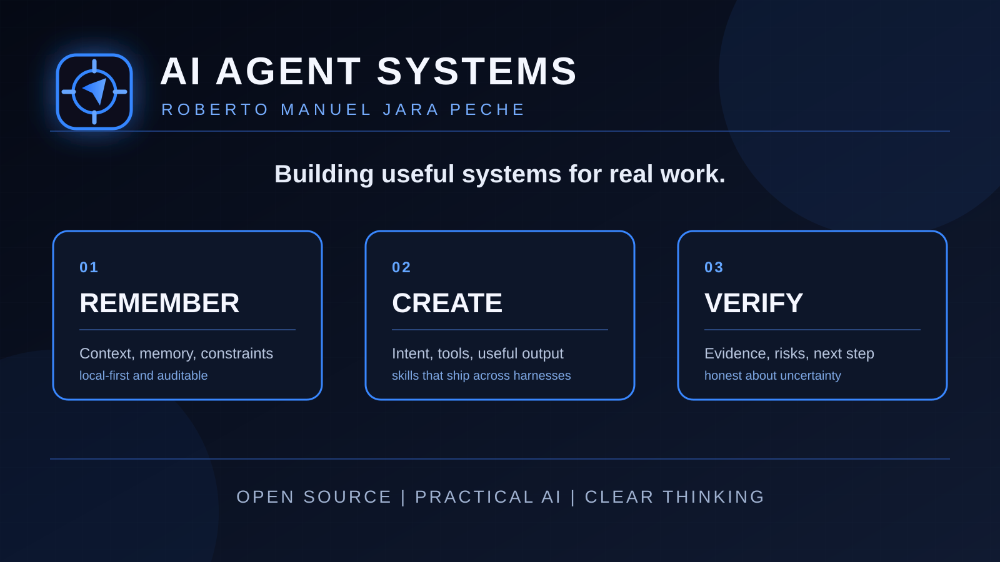

  

<h1 align="center">Roberto Manuel Jara Peche</h1>

  <strong>I build open-source AI agent systems that remember context, create useful outputs, and verify what matters.</strong>

  <a href="https://github.com/ma-nucho-pro">GitHub</a> ·
  <a href="https://www.linkedin.com/in/roberto-manuel-jara-peche-10867240b/">LinkedIn</a> ·
  <a href="https://www.youtube.com/@ManuchoAI">YouTube</a> ·
  <a href="https://www.instagram.com/robertmanuchojp/">Instagram</a>

---

## What I build

My work sits at the intersection of agent orchestration, portable skills, memory, creative tooling, and evidence-based verification. The goal is practical: make AI systems more useful in real workflows without hiding uncertainty or breaking the user's control.

| Pillar | Project | What it contributes |
| --- | --- | --- |
| **Remember** | [Wife](https://github.com/ma-nucho-pro/wife) | Local-first, persistent, auditable memory for agent workflows. |
| **Create** | [ShotPilot](https://github.com/ma-nucho-pro/shotpilot) | A portable image-generation skill that turns intent into structured, production-ready prompts and outputs. |
| **Verify** | [Wonder Woman](https://github.com/ma-nucho-pro/Wonder-Woman) | Adversarial multi-agent verification for claims, decisions, and high-stakes work. |
| **Reflect** | [Clear Mirror](https://github.com/ma-nucho-pro/clear-mirror) | Direct, evidence-grounded strategic reflection that exposes assumptions and leaves a prioritized plan. |

## Open-source focus

- Agent Skills that can move between harnesses instead of being trapped in one chat interface.
- Supervisor and verification patterns for work that needs evidence, review, and explicit uncertainty.
- Local-first tooling that keeps context inspectable and under the user's control.
- Practical AI interfaces for image generation, software work, and repeatable agent workflows.

## Start here

- Want to understand the foundation? Begin with [Wife](https://github.com/ma-nucho-pro/wife).
- Want to generate images through an agent? See [ShotPilot](https://github.com/ma-nucho-pro/shotpilot).
- Want a skeptical review of a plan or assumption? Try [Clear Mirror](https://github.com/ma-nucho-pro/clear-mirror).
- Want adversarial verification? Explore [Wonder Woman](https://github.com/ma-nucho-pro/Wonder-Woman).

## Let's build useful things

If you are building agent workflows, portable skills, or AI systems that need memory and verification, open an issue in the relevant repository or connect with me below. Clear proposals, reproducible examples, and honest failure reports are always welcome.

  
  
  
  

  Open source, practical AI, clear thinking.

